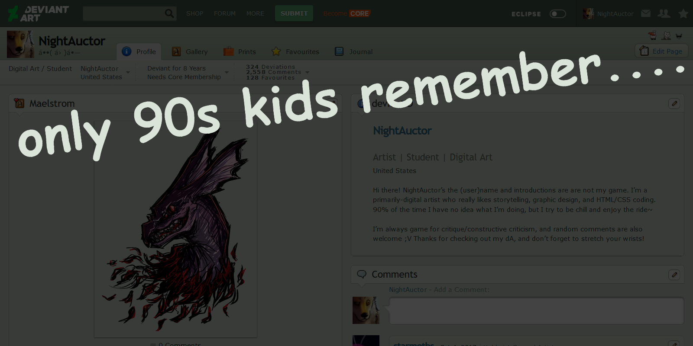

You know, the previous dA layout… was not great. Not responsive, questionable (albeit iconic) color scheme, and very much showing its age. If Eclipse had been the default layout back when I joined deviantART eight(!!) years ago… well, I didn’t care about web design back then, but it could’ve been nice.

Unfortunately, Eclipse as it’s being rolled out is buggy, *still* not 100% responsive, and effectively nukes my precious darling HTML. It is new and it *shows*. The way it forces all your folders to display with thumbnails isn’t my favorite feature either, considering I’ve renovated my gallery to serve as an archive of sorts and *my crusty old art from 2013 doesn’t need a thumbnail display and neither do my not-100%-mine scraps, spare me.*

Anyway.

The last time I posted a journal was [2018](the-future-endeavors), and it can be roughly TL;DR’d as “lost interest in my own comic, lads.” Since then I’ve neither completed the thing nor posted the pages I had as backlog, but if the story still interests you, the closest I’ve gotten to finishing it are summaries via two character profiles: [a deprecated minor character](http://a-flyleaf.glitch.me/shriblets/wiki.html) and [the protagonist herself](https://aflyleafarchive.wordpress.com/2018/09/11/serena-johnson-writeup/). Thaaaat’s probably as close as I’m gonna get, at this point \o/
**NEXT DAY EDIT:** [so this exists now](https://a-flyleaf.github.io/tfe/)

As far as personal updates go, anything relevant just gets crammed into [the yearly roundups](http://fav.me/ddnewcl) now. I don’t really have anything else to write here! Social media is my nemesis and I resent dA trying to turn into one (hello, live notifications, *did not ask* [but at least those can get turned off]). I could use a username change but like hell if I’m spending money on Internet Points, and maybe the outdated name could serve as a nudge for me to *really* haul my stuff over to my own darn site. You know, controlling your own platform and all that jazz, because then *the presentation of everything doesn’t get a complete overhaul because the Higher Website Gods demanded it.*

Anyway x2. There’s [a six fanart challenge](https://twitter.com/mcapriglioneart/status/1240054958508179456) thing going around on twitter, so if you’ve read this far, feel free to toss me a suggestion for that ;V

See ya next time the planets align ✌️